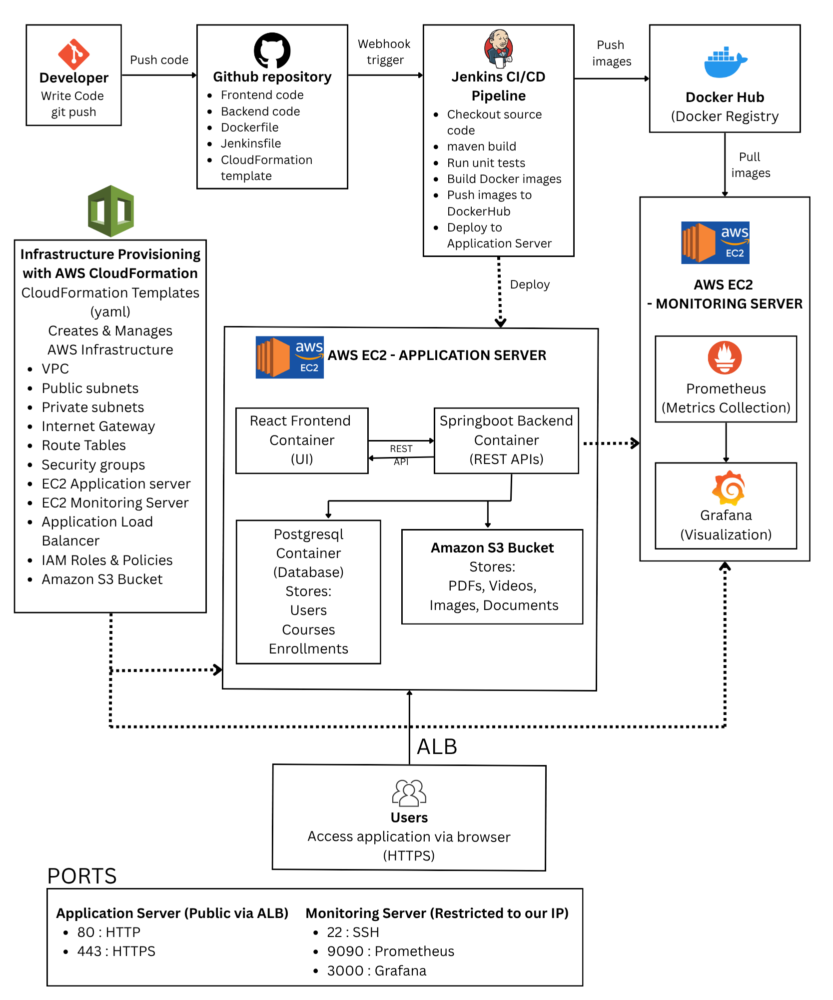
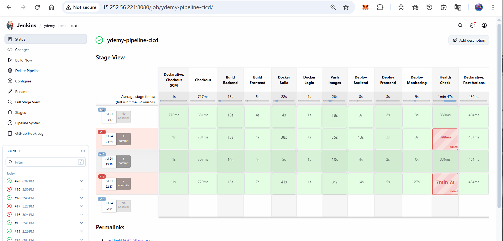
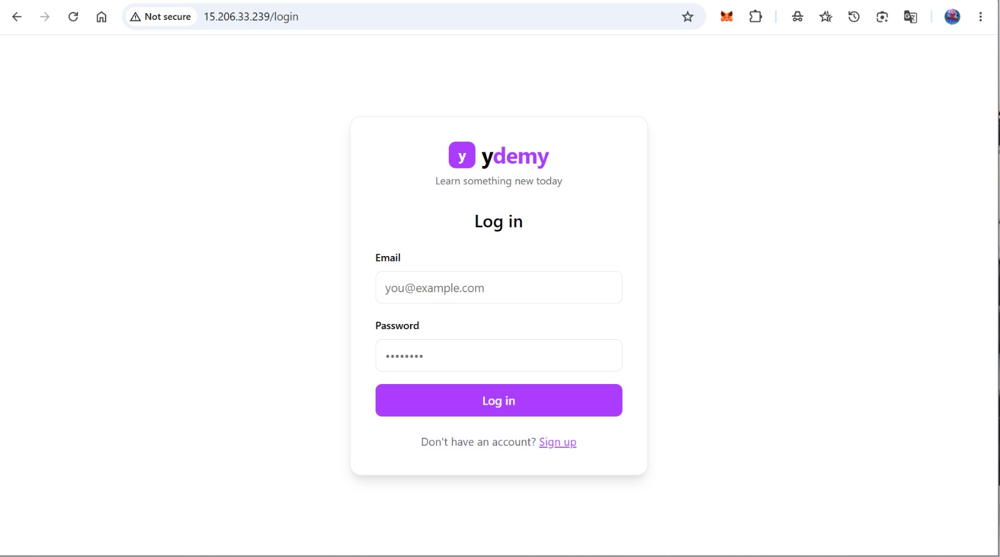
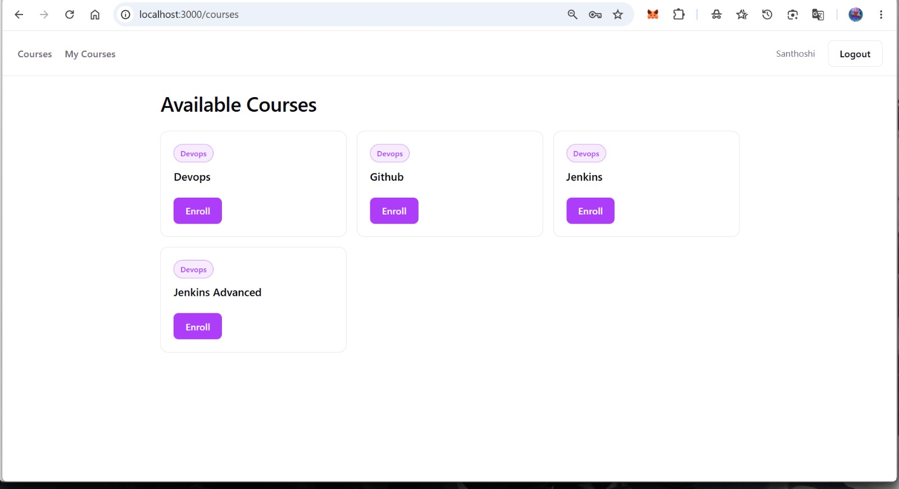
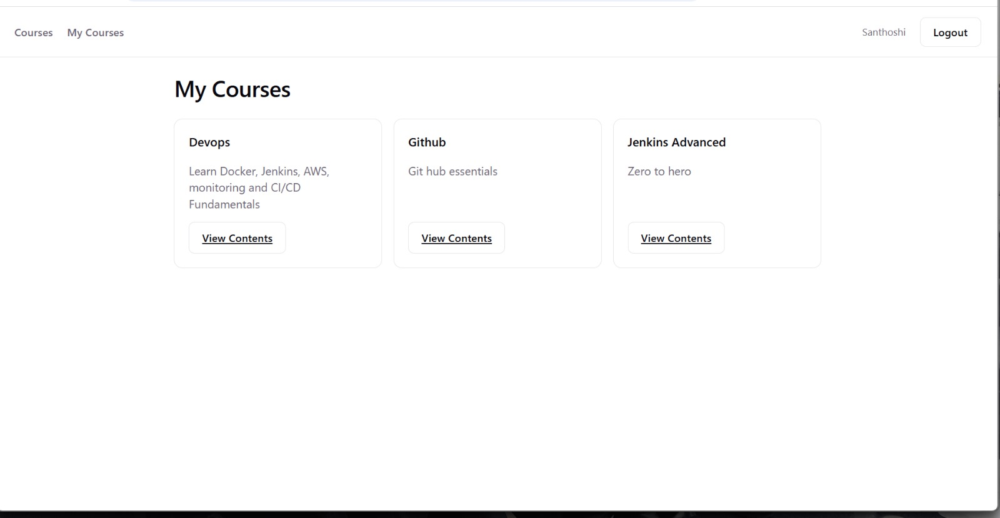
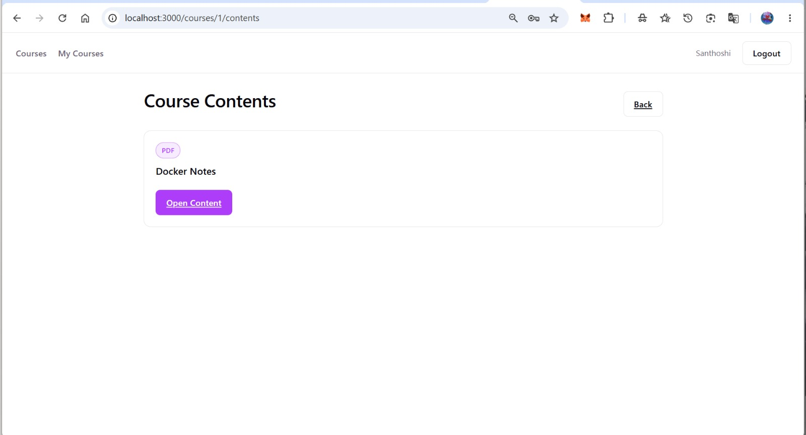
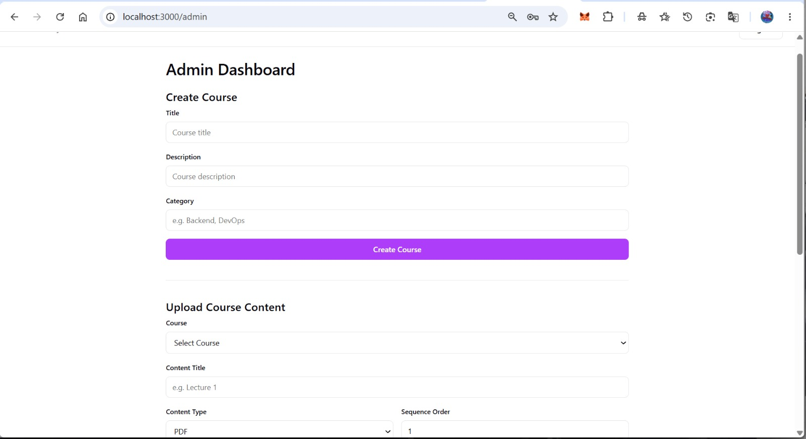
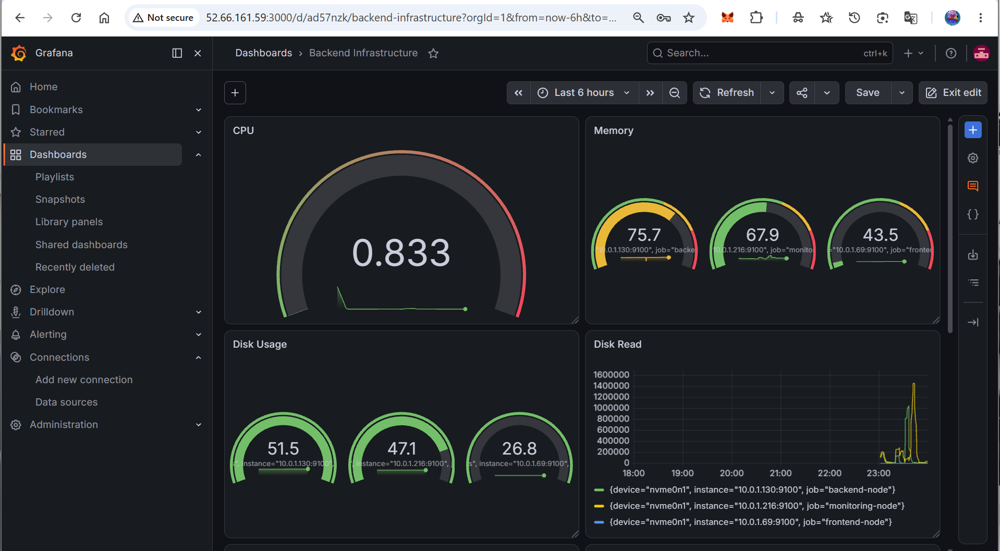
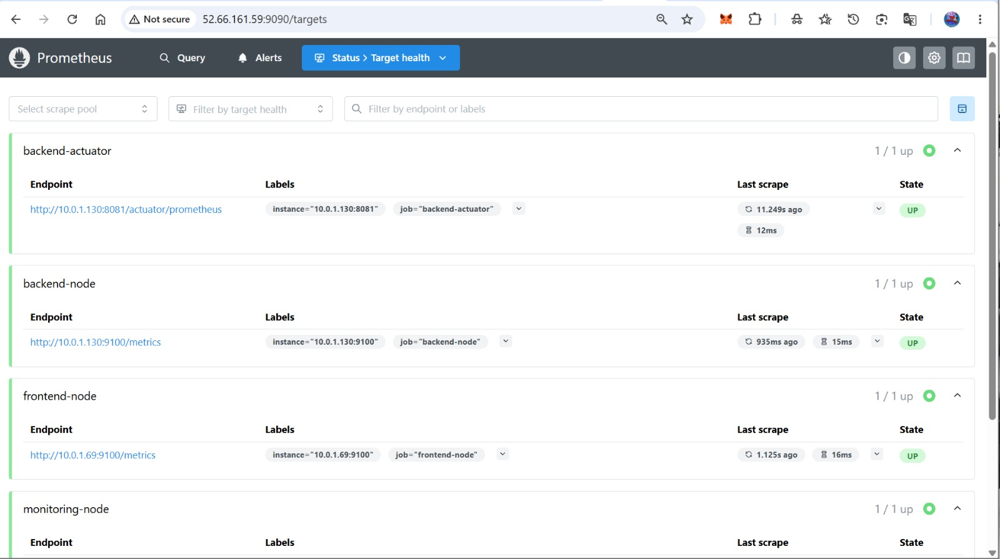

<div align="center">

# 📚 YDEMY E-Learning Platform

### Production-Style Full Stack DevOps Project on AWS

A cloud-native E-Learning Platform built using **React, Spring Boot, PostgreSQL, Docker, Jenkins, AWS CloudFormation, Prometheus, Grafana, and Amazon S3** demonstrating modern DevOps practices including Infrastructure as Code, CI/CD, Monitoring, Containerization, and Cloud Deployment.

</div>

---

# 📑 Table of Contents

- Project Overview
- Features
- Technology Stack
- Architecture
- Infrastructure
- Project Structure
- CI/CD Pipeline
- Monitoring
- Screenshots
- Getting Started
- CloudFormation Deployment
- Docker Deployment
- Future Improvements
- Learning Outcomes

---

# 🚀 Project Overview

This project demonstrates a **production-inspired deployment** of an E-Learning Platform on AWS.

The primary objective was not only to develop the application but also to build an end-to-end DevOps pipeline including:

- Infrastructure as Code
- Dockerized Applications
- CI/CD Automation
- Cloud Deployment
- Secure File Storage
- Monitoring & Observability

---

# ✨ Features

### 👨‍🎓 Student

- Register/Login
- Browse Courses
- Enroll Courses
- View Course Contents
- Access PDF & Video Lessons

### 👨‍💼 Admin

- JWT Authentication
- Create Courses
- Upload PDFs
- Upload Videos
- Manage Course Contents

### ☁ AWS

- Amazon S3 Storage
- EC2 Deployment
- IAM Roles
- CloudFormation
- Security Groups

### ⚙ DevOps

- Docker
- Jenkins Pipeline
- Docker Hub
- GitHub Integration

### 📊 Monitoring

- Spring Boot Actuator
- Micrometer
- Prometheus
- Grafana
- Node Exporter

---

# 🛠 Technology Stack

| Layer | Technologies |
|---------|-------------|
| Frontend | React, Vite, Axios |
| Backend | Java 21, Spring Boot, Spring Security |
| Database | PostgreSQL |
| Storage | Amazon S3 |
| Authentication | JWT |
| Containerization | Docker |
| CI/CD | Jenkins |
| IaC | AWS CloudFormation |
| Monitoring | Prometheus, Grafana |
| Cloud | AWS EC2 |

---

# 🏗 Architecture



---

## Architecture Flow

```text
                    GitHub
                       │
                       ▼
                  Jenkins CI/CD
                       │
        ┌──────────────┼──────────────┐
        ▼              ▼              ▼

 Backend Image    Frontend Image

        │              │
        └──────┬───────┘
               ▼

          Docker Hub

               │

    ┌──────────┼──────────────┐

    ▼          ▼              ▼

 Backend     Frontend     Monitoring

 SpringBoot   React        Grafana
 PostgreSQL   Nginx        Prometheus
 NodeExporter              NodeExporter

          │

          ▼

      Amazon S3
```

---

# ☁ AWS Infrastructure

| Resource | Purpose |
|-----------|----------|
| VPC | Networking |
| Public Subnets | EC2 Deployment |
| Internet Gateway | Internet Access |
| Security Groups | Network Security |
| EC2 | Application Hosting |
| IAM Role | Secure AWS Access |
| Amazon S3 | Course Content Storage |

---

# ⚡ CI/CD Pipeline

```text
GitHub Push

      │

      ▼

Jenkins

      │

Checkout

      │

Build Backend

      │

Build Frontend

      │

Docker Build

      │

Push Docker Images

      │

Deploy Backend

      │

Health Check

      │

Deploy Frontend

      │

Health Check

      │

Deployment Complete
```

---

# 📈 Monitoring

### Prometheus

- Spring Boot Metrics
- Node Exporter Metrics
- Prometheus Self Monitoring

### Grafana Dashboards

- Application Dashboard
- Infrastructure Dashboard
---

# 📷 Screenshots

## Jenkins Pipeline



---

## Frontend







---

## Grafana Dashboard



---

## Prometheus Targets



---

# 📦 Docker

<details>

<summary>Backend Stack</summary>

- Spring Boot
- PostgreSQL
- Node Exporter

</details>

<details>

<summary>Frontend Stack</summary>

- React
- Nginx

</details>

<details>

<summary>Monitoring Stack</summary>

- Prometheus
- Grafana
- Node Exporter

</details>

---

# 🚀 Deployment

## 1. Provision Infrastructure

```bash
aws cloudformation deploy ...
```

---

## 2. Configure Jenkins

- DockerHub Credentials
- SSH Credentials
- GitHub Webhook

---

## 3. Push Code

```bash
git add .

git commit -m "Deploy"

git push
```

Jenkins automatically:

- Builds
- Tests
- Creates Docker Images
- Pushes Images
- Deploys Backend
- Deploys Frontend

---

# 🔒 Security

- JWT Authentication
- IAM Roles
- Security Groups
- Least Privilege Access
- Amazon S3 IAM Permissions
- Docker Isolation

---

# 🎯 Learning Outcomes

✔ Infrastructure as Code

✔ Docker

✔ Jenkins

✔ AWS

✔ CloudFormation

✔ Monitoring

✔ Observability

✔ DevOps

✔ CI/CD

✔ Spring Boot

✔ React

---

# 🔮 Future Improvements

- Kubernetes
- Helm
- ArgoCD
- Terraform
- Alertmanager
- SonarQube
- Trivy
- AWS ECR
- ECS
- EKS
- HTTPS
- Route53
- Application Load Balancer

---

# 👩‍💻 Author

## Santhoshi R

Software Engineer

Java • Spring Boot • React • Docker • Jenkins • AWS • PostgreSQL • Prometheus • Grafana

---

<div align="center">

⭐ If you found this project interesting, consider giving it a star!

</div>
